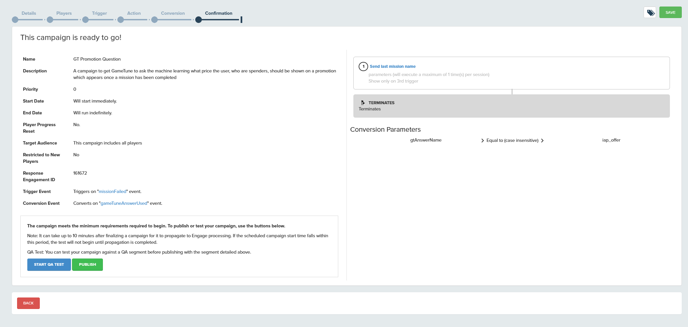

# Introduction

- [Introduction](#introduction)
  - [Analyzing GameTune answers with DeltaDNA](#analyzing-gametune-answers-with-deltadna)
    - [Create a DeltaDNA event](#create-a-deltadna-event)
    - [Create a GameTune question and ask it](#create-a-gametune-question-and-ask-it)
    - [Analyze the answer](#analyze-the-answer)
  - [Using DeltaDNA engagement tools to ask GameTune questions](#using-deltadna-engagement-tools-to-ask-gametune-questions)
    - [Create an Action](#create-an-action)
    - [Create an Event Triggered Campaign](#create-an-event-triggered-campaign)
    - [Ask question using the campaign](#ask-question-using-the-campaign)

DeltaDNA and GameTune can work well in tandem to optimize your game and understand your players to let them experience a personalised experience.

This tutorial provides a couple of example scenarios to provide you with some ideas of how you can integrate both GameTuen and DeltaDNA together.

[Full DeltaDNA documentation](https://docs.deltadna.com/) \
[Full GameTune documentation](https://docs.gametune.unity3d.com)

GameTune also provides an [Event Listener](https://docs.gametune.unity3d.com/#analytics) to which provides details of certain GameTune events which can be used to send details to DeltaDNA for analytics.

## Analyzing GameTune answers with DeltaDNA

### Create a DeltaDNA event

DeltaDNA provides a template event on the platform to record GameTune answers. On your DEV environment, navigate to SETUP > Create an Event. Import the **gameTuneAnswerUsed** template event.


Don't forget to save the event and publish it to your LIVE environment, so that you can start receiving the event from your players. You can publish the event by navigating to SETUP > Manage Events and clicking on the hexagon icon next to the edit button for the relevant event.


### Create a GameTune question and ask it

On your GameTune dashboard, create the question that you wish to analyze by selecting your optimization target and choosing your alternatives. For this example, a question which decides how quickly the difficulty of the game will increase for the player has been created.

In your code, create the Question object and ask GameTune the question.

```csharp
Question difficultyQuestion = GameTune.CreateQuestion(
            "difficulty_ramp",
            new string[] { "medium", "high", "low" },
            DifficultyRampHandler
        );

GameTune.AskQuestions(difficultyQuestion);
```

When you use the answer you have received from GameTune, send the **gameTuneAnswerUsed** event to DeltaDNA.

```csharp
gtAnswerUsedEvent = new GameEvent("gameTuneAnswerUsed")
                .AddParam("gtAnswerID", answer.Id)
                .AddParam("gtAnswerTreatmentGroup", answer.TreatmentGroup)
                .AddParam("gtAnswerValue", answer.Value)
                .AddParam("gtModelName", answer.ModelName)
                .AddParam("gtModelVersion", answer.ModelVersion);

DDNA.Instance.RecordEvent(gtAnswerUsedEvent);
```

> **Important:** The model name and model version parameters are only available to use when the treatment group is "ml"

### Analyze the answer

Once you have received a number of gameTuneAnswerUsed events, you can start looking into analyzing the results of the GameTune machine learning.

A great way to start the analysis is to create a segment for each of your alternatives and filter any of your favourite KPIs using the segment.

Navigate to **ENGAGE** > **SEGMENTATION** > **Manage Segments**. From here you can create your segment by clicking on the "CREATE A SEGMENT" button and selecting event segment. Give your segment a useful name, such as the question name and the name of your selected varient. Finally, add a filter group for the name of your chosen question and a filter group for the name of your selected varient.


If you wish to compare your varients on the same graph or in the same dashboard, you can use our analyze tools to build your own queries.


The queries used for these graphs can be found in the [example query file](AnalysisExampleQueries.md).

## Using DeltaDNA engagement tools to ask GameTune questions

In order to improve the choices made by the machine learning, you can set user attributes to be sent to the platform with a question. By using campaigns and actions, you can collect metrics from the DeltaDNA platform and set them as your user parameters.

### Create an Action

To send parameters to the game client, it will be necessary to use a Game Parameter action. The parameters sent can have custom values created by you or metrics generated from the data you have sent in to the DeltaDNA platform.

To create a Game Parameter action:

1. Navigate to **Engage** > **Actions**
2. Click the create button under the **Game Parameter** category
3. Name you action
4. Add the parameters you wish to send with the action - you can send either a static parameter or a metric.
5. Save your action

In this example, the last mission completed is sent in order to give an idea of player progression in the game.


### Create an Event Triggered Campaign

In order to send the action that has just been created to the client, it is necessary to create a campaign. For this example, an event triggered campaign has been created on the mission failed event and will be triggered on every third mission failed.

To create this event triggered campaign:

1. Navigate to ENGAGE > Event-Trigged Campaigns
2. Click on Create Campaign
3. Name your campaign and give it a description
4. Set your campaign to start now and to run indefinitely \

5. Set the target segment to cover all players \

6. Set the trigger to the missionFailed event \

7. Set the action to be sent as the action which was created before and set the campaign to only trigger on every third missionFailed event \

8. Set the conversion event to the gameTuneAnswerUsed event in order to convert the player out of the campaign once they have had their varient assigned \

9. Check all of the details for the campaign are correct and finally click on the publish button to publish your campaign \


### Ask question using the campaign

Now that an action and a campaign has been set up, in your code you can handle the action and ask GameTune a question using the parameters you received from the action.

Declare a parameter handler in your code:

```csharp
DDNA.Instance.Settings.DefaultGameParameterHandler = new GameParametersHandler(gameParameters => {
            ParameterHandler(gameParameters);
        });
```

In the parameter handler, set the User Attributes for your GameTune question using the game parameters sent by the action. Finally, ask GameTune your question.

```csharp
private void ParameterHandler(Dictionary<string, object> gameParameters)
    {
        //Use the game parameters received from DeltaDNA as a userAttribute to send to GameTune
        Dictionary<string, object> userAttributes = new Dictionary<string, object>()
        {
            {"lastMission", gameParameters["missionName"]}
        };

        //Set the userAttributes so that they are sent with the next question
        GameTune.SetUserAttributes(userAttributes);

        // Create a GameTune question to ask if the user should get a low, medium or high promotion offer
        Question iapQuestion = GameTune.CreateQuestion(
            "iap_offer",
            new string[] { "medium", "high", "low" },
            GameTuneManager.IAPOfferHandler
        );

        //Ask the GameTune question
        GameTune.AskQuestions(iapQuestion);
    }
```
